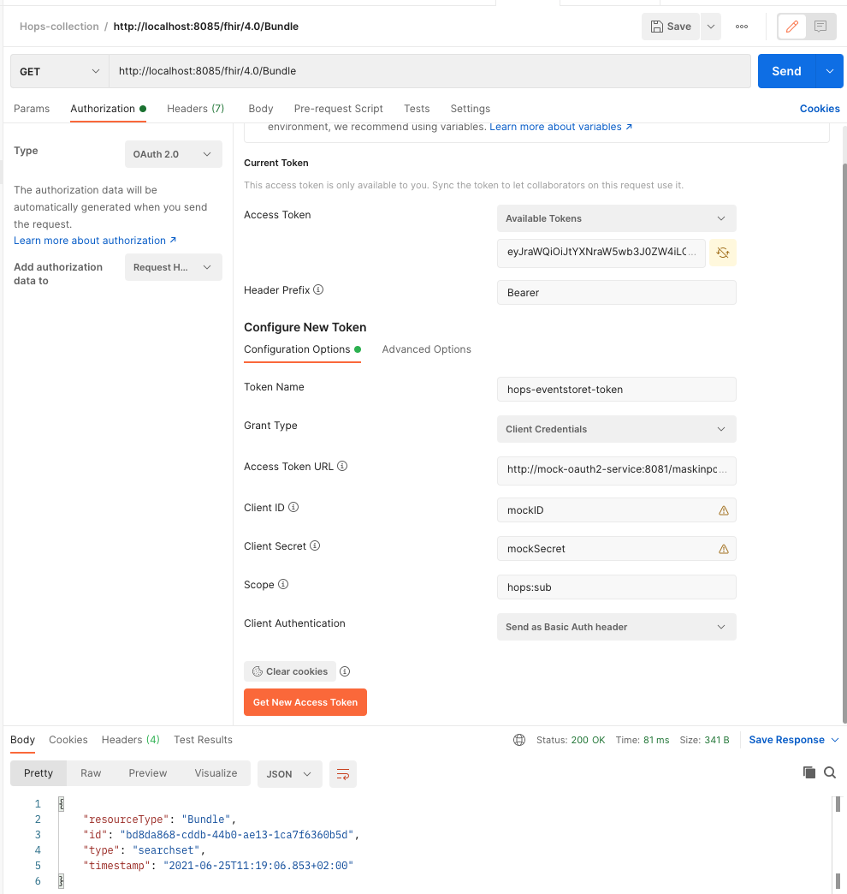

# API
The responsibility of this service is to provide an external API for the healthcare-sector. 

Services within NAV will access messages on Kafka, but for external clients we want to provide a simple FHIR RESTful API, see [MessagingCore IG](https://navikt.github.io/fhir/igs/MessagingCore/).
This service will also provide the appropriate auth integration (HelseId, maskinporten) and documentation.

This service is currently accessing the *hops-EventStore* API directly, but it might be neccessary for it to have its own database in order to provide the expected capabilities and performance.

## 🌈 Testing the API endpoints
Goto; the swagger documentation below or the [openapi](.config/web/openapi.yaml) specification. 
- [http://localhost:8085](http://localhost:8085) (if started with docker-compose)
- [http://localhost:8080](http://localhost:8080) (if started with Gradle or IDEA)

If the ports doesn't work, check out [docker-compose.yml](../../.docker/docker-compose.yml)

### 👐 Unsecured endpoints
Expected `200 OK`:
- /actuator/live 
- /actuator/ready
- /actuator/metrics

### 🤝 Secured endpoints
- GET /fhir/4.0/Bundle
- POST /fhir/4.0/$prosess-message

In Postman: 

* Make a `get` request to `http://localhost:8085/fhir/4.0/Bundle`
* Click the `Authorization` tab
* In the `Type` dropdown, select `OAuth 2.0`
* In the `Add authorization data to` dropdown, select `Request Headers`
* In the `Header Prefix` field, write `Bearer`
* In the `Token name` field, write `anything`
* In the `Grant type` dropdown, select `Client Credentials`
* In the `Access Token URL` field, write `http://mock-oauth2-service:8081/maskinporten/token`
* In the `Client ID` field, write `anything`
* In the `Client Secret` field, write `anything`
* In the `Client Scope` field, write `hops`
* In the `Client Authentication` dropdown, select `Send as Basic Auth header`
* Click the `Get New Access Token` button
* Click `Send`

You should then get at `200 OK` and a response JSON

Note: You can limit the access by setting `Scope= hops:sub` to only be able to use the `get` endpoint
and `Scope= hops:pub` to only use the `post` endpoint

If you are testing the EventStore directly
(or other apps that are not reachable externally) you have to use the "internal token":
`http://mock-oauth2-service:8081/default/token` with `Scope = eventstore`
