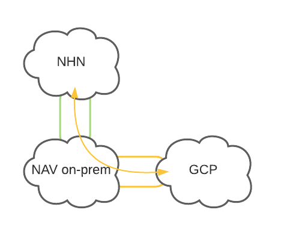
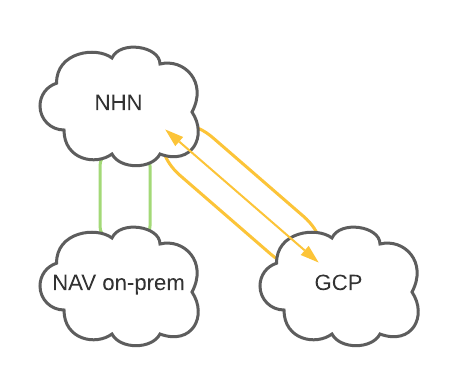

# NHN Interconnection

## Context

In the Norwegian Healthcare sector many computers and services that handle healthcare data are only accessible within a private network called [NHN](https://www.nhn.no/helsenettet/hva-er-helsenettet).

For our service to be available in this network we must be able to connect with this network. NAV currently had an interconnection for it's on-premise environment, but our application lives in the GCP platform.

## Decision

So for in this project we haven't found a final solution for this problem. We did however had a meeting with a security expert at NAV and explored some options that will require further exploration:

In this setup we would use the existing interconnect between the on-prem datacenter and NHN.

In this setup we would have to work together with Google to see if they can provide this service in as in their offering.

As we are not likely to be the only team that will require access to this network, we were encouraged to continue this exploration together with the #nais team. 

