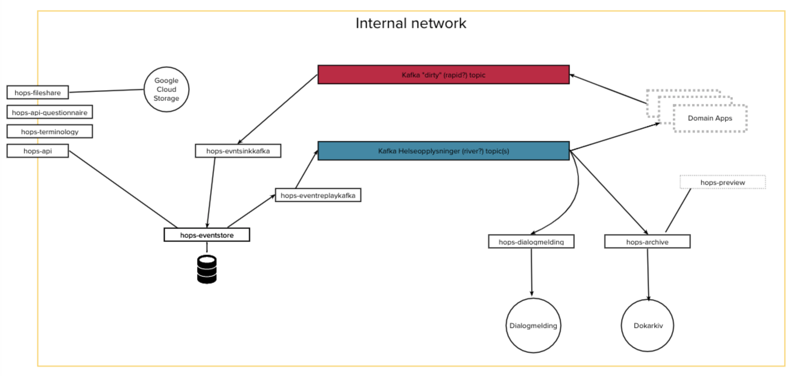

# Backend Documentation

[ADRs](./adrs)

[Testing strategy](./test/test-strategy.md)

[Pipeline - Dependabot](./pipeline/auto-merge-dependabot.md)

[Pipeline - Licence Audit](./pipeline/licence-audit.md)

## Services overview

- [hops-api](../apps/hops-api): This service is to provide an external API for the healthcare-sector. It is thin proxy responsible for authorizing and then forwarding the request to `hops-eventstore`.
- [hops-terminology](../apps/hops-terminology): This service provides the functionality described by the [Terminology Service](https://www.hl7.org/fhir/terminology-service.html).
- [hops-api-questionnaire](../apps/hops-api-questionnaire): The responsibility of this service is to pull [FHIR Questionnaire](https://www.hl7.org/fhir/questionnaire.html) resources from the [navikt/fhir-questionnaires](https://github.com/navikt/fhir-questionnaires) GitHub repository and make them available through a minimal (but valid) read-only [FHIR RESTful API](https://www.hl7.org/fhir/http.html).
- [hops-fileshare](../apps/hops-fileshare): This service provides a simple API to upload and download files, it uses Google Cloud Storage to store the files.
- [hops-eventstore](../apps/hops-eventstore): The purpose of this service is to be the master-store for FHIR messages. It exposes a simple RESTful API, decoupled from the underlying data-store.
- [hops-archive](../apps/hops-archive): The responsibility of this service is to pull relevant FHIR messages from Kafka and archive them as PDFs in Joark.
- [hops-eventreplaykafka](../apps/hops-eventreplaykafka): The responsibility of this service is to pull FHIR messages from the hops-EventStore API and publish them on a Kafka-topic.
- [hops-eventsinkkafka](../apps/hops-eventsinkkafka): The responsibility of this service is to pull FHIR Messages from a Kafka topic and POST them to the `hops-eventstore` API.
- [hops-dialogmelding](../apps/hops-dialogmelding): The responsibility of this service is to pull relevant FHIR messages from Kafka, generate a PDF and send it as a Dialogmelding of type DIALOG_NOTAT to the relevant receiver identified by HER-id.

## Service interactions

The following diagram show how the services interact with each other:

The `hops-api` service is a thin layer that uses the `hops-eventstore` as a backend to serve and ingest resources. The `hops-eventstore` stores these FHIR messages as immutable events in a `Postgres` database. The `hops-eventreplaykafka` uses an API from the `hops-eventstore` that allows it to poll messages and post them in `Kafka` topic. These messages are then consumed by other downstream domain applications in NAV, and also by our own services as `hops-archive` which generates a human-readable version of Questionnaires and stores them in `Dokarkiv`, or the `hops-dialogmelding` which sends communication messages to healthcare workers using the `dialogmelding` service. An additional `Kafka` topic is used to receive messages form other NAV domain applications, these messages are then consumed by the `hops-eventsinkkafka` service that will use the same API and the `hops-api` to post messages to the `hops-eventstore`      

