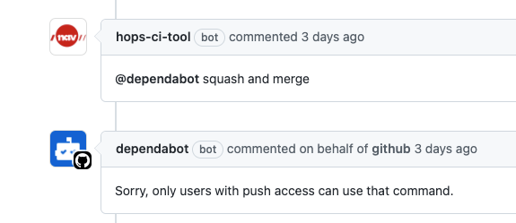

# Auto Merge Dependabot Pull Request

## The annoying problem
March 1 2021, [GitHub changed](https://github.blog/changelog/2021-02-19-github-actions-workflows-triggered-by-dependabot-prs-will-run-with-read-only-permissions/)
the permissions for the `GITHUB_TOKEN` to __read only__ in the `pull_request` event.

GitHub offers [auto-merge](https://docs.github.com/en/github/collaborating-with-pull-requests/incorporating-changes-from-a-pull-request/automatically-merging-a-pull-request) 
options for pull-request but this has its drawbacks. <br/>
We will have to choose between the dilemma:
- Have every pull-request auto merged once anyone has approved it
- Enable `Require review from Code Owners` where no bot can approve for us.

By the latter option, dependabot or any GitHub App is not a valid Code Owner.

We cannot create a Personal Access Token (PAT) either, because
the `pull_request` event can't read repository __secrets__.

Ok, so lets rethink the situation and use `workflow_run` or `pull_request_targe` event.
We will have access to repository __secrets__ and we will have __write__ permission on the `GITHUB_TOKEN`.
Then we can select one of the many GitHub Actions that merges the pull-request, 
or better we can comment on the pull-request with `@dependabot merge and squash` to let it rebase, merge and squash for us!

Oh snap!

OK, Lets create a GitHub App, transfer it to the organization, request ownership, 
set the correct permissions, add it to the repository, then issue an [installation token](https://github.com/navikt/github-app-token-generator)
and use that token in the __GitHub CLI__ and call `gh pr comment $PR_BRANCH --body @dependabot merge and squash`.

So what is happening?

The type of permissions is different between users and GitHub Apps, 
and the scope we are actually looking for is the `public_repo` __write__ scope,
that is only available from a PAT.

Can we create an Organizational token? 
No, everyone with this token in the org will have __write__ access to every repo
that uses this token. Even if we trust every team, this is a security
risk that someone in the organization have to evaluate and reason for
again and again and again.

Team token? GitHub claims the GitHub Apps installation token is for this purpose,
even though it does not give us the access we want.

## How did we solve it
First we need to set up a `pull_request_target` workflow.
This is because it has __read__ permission repository __secrets__.
When using the `pull_request_target` event we have to be careful to not let any forks [pwn us](https://securitylab.github.com/research/github-actions-preventing-pwn-requests/).

### If fork then deny
It is very imprtant that every job checks if the event is triggered by a fork or not.
We also have to be careful to not let any jobs allowed by a fork, to "checkout" the code with e.g `actions/checkout@v2`.
If we by any means want to do this in the future, we must make sure the checkout action is checking out our code, 
and not the forked code.

### HOPS CI Tool
We created a GitHub App named `HOPS CI Tool` that has the following [permissions](https://github.com/organizations/navikt/settings/apps/hops-ci-tool/permissions):
- Metadata: read
- Pull requests: write

This app will be doing the stuff like commenting, merging and reporting tests/lints.

After doing linting testing and regular CI/CD stuff we will check that the semantic version
of the dependabot is `minor` or `patch`. We want to review major releases ourselves.

```yaml
# Get metadata from dependabot
- name: 🟡️ Fetch metadata
  uses: dependabot/fetch-metadata@v1.1.1
  id: metadata
  with:
    github-token: ${{ secrets.GITHUB_TOKEN }}

# Fail the workflow job if version is major 
- name: 🔴 Illegal version update
  if: ${{ steps.metadata.outputs.update-type == 'version-update:semver-major' }}
  run: exit 1
```

### Auto Merge
We can verify the `check-suites` and `check-runs` manually in the `pull_request_target` event,
but this is error-prone and is done automatically by listening to the `workflow_run` with conclusion `success`.

The only thing we want to do in this workflow is to merge, 
but before we merge we have to make the branch protection rule of `require codeowners approval` happy,
we created a PAT only for this purpose. This PAT can be anyone's from the `helseopplysninger` team.
Then we use the [GitHub CLI](https://cli.github.com/) to approve the pull-request. 

One restriction we want to make, is to only allow for `github.actor == dependabot[bot]` that is the
actor of dependabot native. We will also restrict the branches to `dependabot/**` to be explicit.
The last thin we check is that `github.event.workflow_run.conclusion == "success"`, 
so we don't merge if any check-runs in the pull-request has failed.

Then we comment the pull-request for sportsmanship. This requires the installation token (we simply call it team token).

At last we merge the pull-request, again we cannot use `@dependabot merge` because we don't have `public_repo write` permission.
We do however have write permission to the pull-request so we can merge with the use of [GitHub CLI](https://cli.github.com/).
```yaml
- name: 🧩️ Merge
  run: gh pr merge $PR_BRANCH --squash
  env:
    GITHUB_TOKEN: ${{ steps.gen-token.outputs.token }}
    PR_BRANCH: ${{ github.event.workflow_run.head_branch }}
    GH_REPO: ${{ github.repository }}
```

Note: we cannot skip the approve step with the PAT and use `--admin` flag in gh cli, because
the branch protection rule still blocks any admin overrides that is not a codeowner.
It is also dangerous to override this in case of merge conflicts.

# TODO
To preserve the __principle of least privilege__, we can restrict the [permission scope](https://github.blog/changelog/2021-04-20-github-actions-control-permissions-for-github_token/) 
of the GITHUB_TOKEN in every job.
