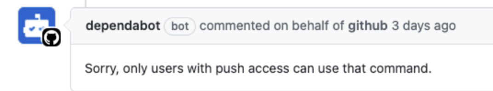

# Auto Merge Dependabot Pull Request

## Problem
On March 1, 2021, [GitHub changed](https://github.blog/changelog/2021-02-19-github-actions-workflows-triggered-by-dependabot-prs-will-run-with-read-only-permissions/)
the permissions for the `GITHUB_TOKEN` to __read only__ in the `pull_request` event.

They have also __revoked__ the `pull_request` events access to repository __secrets__. 

We may think that a `workflow_run` or a `pull_request_target` will solve this, 
but sadly every GitHub Action that offers auto-merge cannot use the `GITHUB_TOKEN` even with write permissions.

GitHub offers auto-merge options for pull-request, but this will again bite us if we want to have the branch
protection rule `require codeowner approval`.

We might be tempted to use a `workflow_run` or a `pull_request_target` and write a comment to the pull-request with
the message `@dependabot merge and squash`, but again dependabot native will not do this and respond with


We even tried to create a custom GitHub App and issue its [installation token](https://github.com/navikt/github-app-token-generator)
but got the same restriction from dependabot.

## Solution
First we need to set up a `pull_request_target` workflow.
This is because it has __write__ permission on its magical `GITHUB_TOKEN`.

We had to create a GitHub App with the following permissions to be able to comment and merge a pull-request:
- Checks: write
- Contents: write
- Issues: write
- Metadata: read
- Pull requests: write

We can run linter, tests and publish both results to the pull-request because `GITHUB_TOKEN` has "write" permissions.

We also check for minior and patch semantic versions from dependabot.
```yaml
# get metadata from dependabot's analysis
- name: 🟡️ Fetch metadata
  uses: dependabot/fetch-metadata@v1.1.1
  id: metadata
  with:
    github-token: ${{ secrets.GITHUB_TOKEN }}

# fail the workflow if semantic update version is major. 
- name: 🔴 Illegal version update
  if: ${{ steps.metadata.outputs.update-type == 'version-update:semver-major' }}
  run: exit 1
```

Now we will add a second workflow to listen to successful runs. This is because we dont want to manually assert all the
check-suites.

The `workflow_run` is restricted to only trigger if github.actor is dependabot, and that the pull_request_trigger was successfuly.

A CODEOWNER's PAT have to be included in the repository secrets and be used to approve the pull-request.
Because bots cannot be a codeowner, we cant use our GitHub App here.

We also tried to skip this by using using admin rights `gh cli merge --squash --admin`.
First off, the branch protection rule did not permit this because the actor was not a codeowner,
and it will bypass the check-runs, e.g merge-conflicts.

We will use the GitHub Apps token to comment and merge the branch.

### Warning
When using this event, we have to make sure a pull-request made from a fork cannot access our repository.
We cannot allow the *pull-request fork* to access `actions/checkout@v2` or any of our __secrets__.
