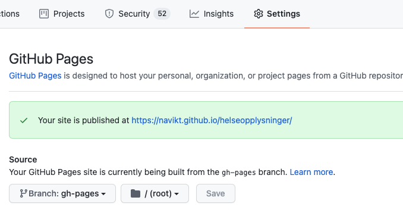
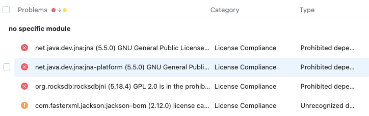

# Licence Audits
We use [Qodana](https://www.jetbrains.com/qodana/) for licence auditing. This tool will transitively scan all our
dependencies and comparare them to our licence.

## Gotchas
Open Source Software (OSS) licencing is inaccurate, misleading, sloppy and often treated as an afterthought.
A gotcha is to blindly trust your immediate dependencies authors.

⚠️ You have to comply with the licenses of _all_ components in your system. Transitive dependencies can hide surprises
#### GPL
A transitive dependency is published under GPL license, this requires your application
to be made available under the GPL. This can be undesirable.

#### LGPL
These licenses can be hard to understand, and experts recommend using an attorney to review
it before usage. 

#### Patents
A transitive dependency might be licenced with a restrictive patent grant.

## Qodana Licence Audit
A daily scheduled GitHub Action will scan the projects from licence compliance.

The results of the reports is added to the `gh-pages` branch, and is accessible through
GitHub Pages.  


Look for the `Prohibited dependency licence` type. These have to be resolved asap.


A __gradle task__ is available to easily scan for transitive dependencies.
> ./gradlew allDeps

You could also dump it into a file for easier searchability
> ./gradlew allDeps > build/allDeps.txt

In the example above, I will exclude the nearest unused dependency:
```kotlin
    testImplementation("no.nav:kafka-embedded-env:2.8.0") {
        // This package contains rocksdbjni
        exclude("org.apache.kafka", "kafka-streams")
    }
```
