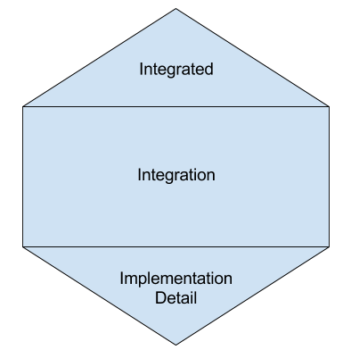

# Test Strategy
We are inspired by Spotify's [Testing Honeycomb](https://engineering.atspotify.com/2018/01/11/testing-of-microservices/)
and Martin Fowler's [Testing Strategies for Microservice Architecture](https://martinfowler.com/articles/microservice-testing).

##  Honeycomb testing strategy
Like the traditional test pyramid, the honeycomb demonstrates how the tests should be organized. 

|  HOPS Terminology |
|---|
| `e2e` or `integration test` <td rowspan="3"></td>|
| `test` or `component test` |
| `unit test` |

### e2e 
😤 → 🍕→ 😋 → 🚽 → 💩 

We will test the integrations `end-to-end` within our domain before every prod deploy.  
The goal is to maintain as few e2e tests as possible.  
Therefore we have to carefully test the most critical parts; mostly to verify our assumptions made in the other tests.  
These tests will be triggered by a `live` test application that runs in `dev` to speed up the workflow (pipeline). 

Valueble tests are
- important use cases
- order of messages
- valid states (consistency)
- database queries not supported by in-memory database
- Applying and verifying schemas (kafka)

### test (component test) 
🔎👩 - 🔎🚗 - 🔎🏠

Testing the application in isolation.  
Martin folwer call them `components`. We can think of them as a value chain within an application.  

A microservice can contain multiple components.  
⚠️ **Most of the tests will be written with this strategy.**  
This strategy also enables Test Driven Development (TDD) and Behaviour Driven Development (BDD).  
This is because we don't care how its implemented, but how the component behaves given some input. 

What we test is usually
- expected use cases
- offered features
- backward compatibility
- fallbacks, recoveries and behaviours
- configurations

### unit test 
🔎👂 🔎👅 🔎👀 🔎👃

Sometimes it is impossible to write a component test that `hits` a certain part of the application that we find critical.  
This code is isolated and cannot be triggered by the application endpoints.  
Therefore this is superb for libraries, algorithms and such.

Some test frameworks are so good they will make a component test obsolete,  
like Apache's [topology test driver](https://docs.confluent.io/platform/current/streams/developer-guide/test-streams.html) for kafka streams.
